# Feature Walkthrough: Hart Ops Prototype

**Commit range:** `084401ad..HEAD` (18 commits)
**Date:** March 31, 2026

This document demonstrates all new features added to the Hart Ops prototype, covering the Ops (Super Admin) and Educator Manager platforms. Each feature includes a description and live screenshot captured from the running application.

---

## Ops Platform

### 1. Educator Availability Calendar

**Implemented:** March 27, 2026 · `cfe95e7`

A centralized weekly calendar view showing all educators' availability at a glance. Operations managers can quickly identify scheduling gaps and plan assignments.

**Key features:**
- Weekly grid with 3 time periods: Morning (AM), Afternoon (PM), Evening (Eve)
- Color-coded time slots (gold/slate/purple)
- Status filter tabs (Active / Inactive / All)
- Search by educator name or location
- Week navigation with "This Week" quick access
- Legend for time period icons

**Route:** `/ops/dashboard/availability`

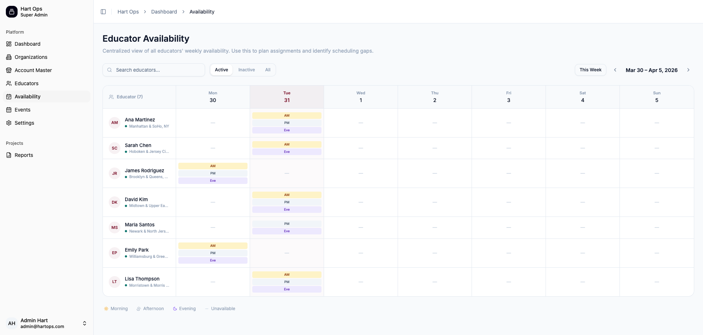

---

### 2. Ops Educators Roster

**Implemented:** March 27, 2026 · `890c637`, `2c3c1b9`

A sortable, filterable educator roster view for operations administrators. Displays quality scores with trend indicators, status badges, specialties, and event completion counts.

**Key features:**
- Sortable columns (Educator, Location, Status, Quality Score, Events Completed, Last Event)
- Multi-filter dropdowns (Status, State, Specialties)
- Quality score with trend arrows (improving/declining/stable)
- Specialty tags per educator
- Pagination (8 per page)

**Route:** `/ops/dashboard/educators`

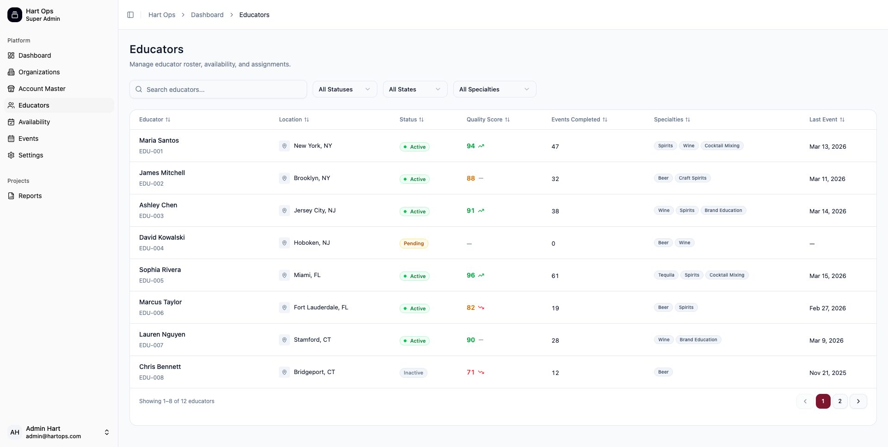

---

### 3. Educator Detail — Performance Scorecard

**Implemented:** March 27, 2026 · `890c637` (detail redesign), `2c3c1b9` (quality scoring)

Redesigned educator detail page featuring a custom profile header and a dedicated Performance Scorecard section. The scorecard calculates a composite Quality Score (0–100) from weighted metrics.

**Key features:**
- Profile header with avatar, status badge, quality score badge, location, and event count
- Info grid: Location, Status, Events Completed, Last Event, Quality Score, Specialties
- **Performance Scorecard:**
  - Circular SVG ring indicator showing composite Quality Score
  - Score level badge (Excellent/Average/Needs Improvement) with color coding (green/amber/red)
  - Trend indicator (Improving/Declining/Stable)
  - Metric breakdown cards: **Reliability**, **On-Time Rate**, **Survey Quality** — each with percentage and progress bar
- Recent Activity table with event name, account, date, status, and units

**Route:** `/ops/dashboard/educators/:id`

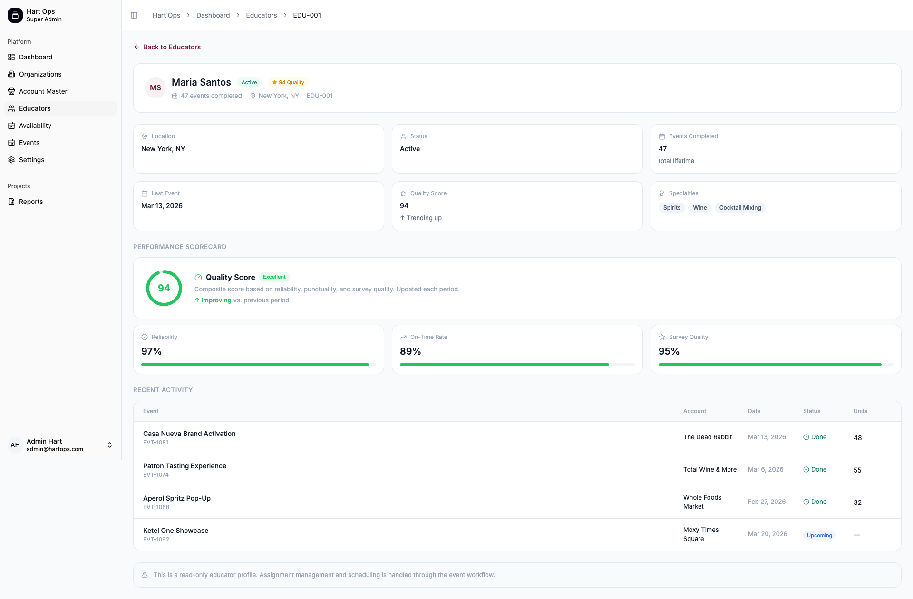

---

### 4. Ops Events — Cross-Organization Omni View

**Implemented:** March 26, 2026 · `9f597eb`

A cross-organization event monitoring table providing the operations team with a single view of all events across all client organizations.

**Key features:**
- Searchable event list with organization, type, date/time, attendees, and status
- Filter dropdowns: Organization, Status (Live/Upcoming/Completed/Cancelled), Type (In-Person/Virtual/Hybrid)
- Live status with pulsing green indicator
- Attendees tracking (registered/capacity)
- Pagination with page navigation

**Route:** `/ops/dashboard/events`

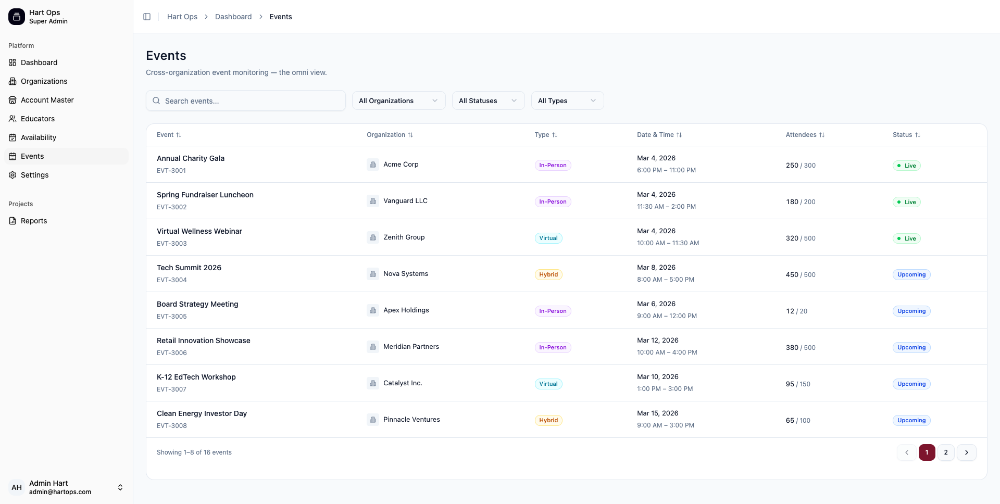

---

## Educator Manager Platform

### 5. Educator Manager Dashboard & Offer Status Tracking

**Implemented:** March 27, 2026 · `fafd108`

A comprehensive dashboard for educator managers showing key metrics, pending offers, event trends, and items requiring attention.

**Key features:**
- **Stat Cards:** Total Events This Week, Active Events Now, Events Requiring Attention — with trend indicators
- **Pending Offers Summary:** Displays counts for Awaiting, Accepted, and Declined offers with color-coded cards
- **Events Trend Chart:** 6-month area chart showing monthly event volume
- **Weekly Activity Chart:** Bar chart showing events per day of the current week
- **Events Requiring Attention:** List of events needing action (unassigned, awaiting finalization) with alert reasons
- **Educator Performance Rankings:** Top educators ranked by average rating with trend arrows
- **Upcoming Events:** Next scheduled events with venue and educator assignments

**Route:** `/educator/dashboard`

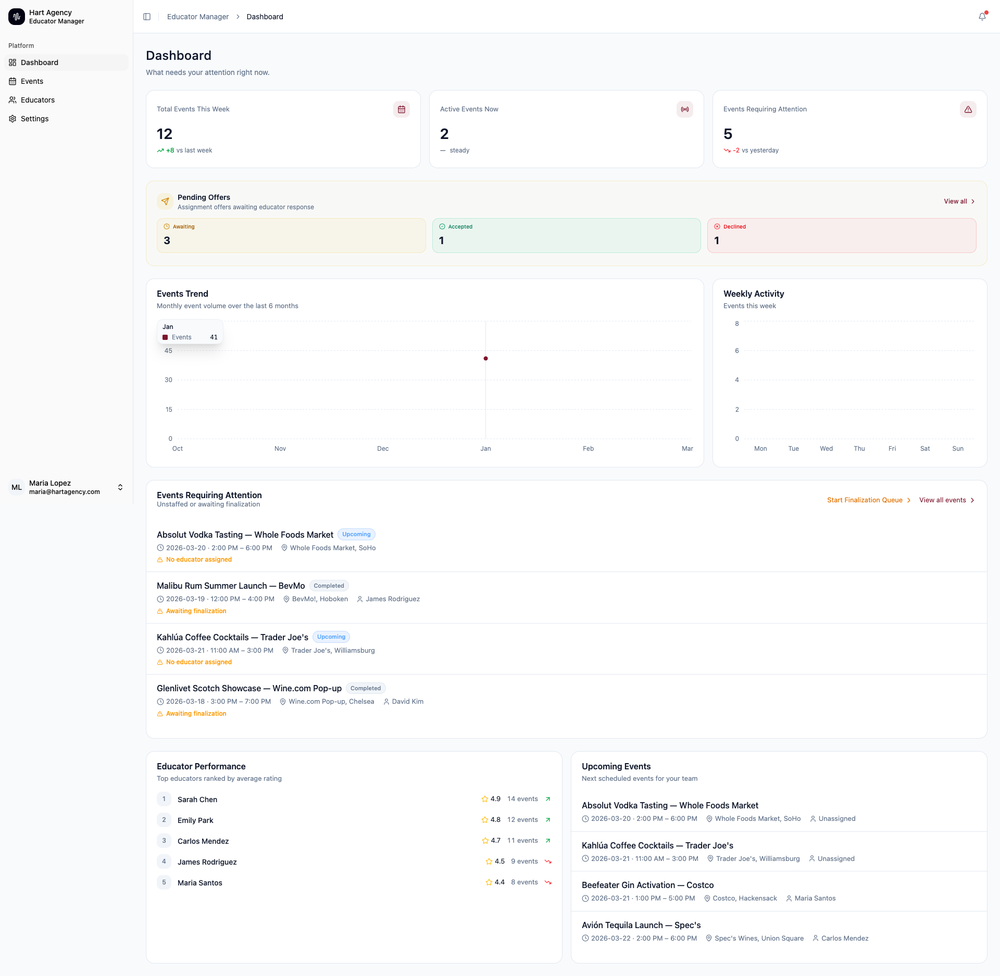

---

### 6. Events Page — List View (7-State Lifecycle)

**Implemented:** March 26–31, 2026 · `4dd8101` (punctuality), `d5df704` (cancellation tracking), `fafd108` (offer status)

Events management with a 7-state lifecycle tracking system (Unassigned → Pending → Confirmed → Live → Completed → Finalized, with Cancelled branch).

**Key features:**
- Status filter tabs with counts: All, Upcoming, Live, Completed
- 7 color-coded status badges following the event lifecycle state machine
- Event type badges: Tasting (purple), Demo (cyan), Activation (orange), Promo (pink)
- **Punctuality flags:** "Late" badge for late check-ins (>10 min), "Early Out" for early checkouts
- **Cancellation request tracking:** "Cancel Requested" badge on events with pending cancellation
- "Review" badge for events awaiting post-event review
- Territory filters: Borough, State, Venue Type dropdowns
- Sort controls and search
- Finalize queue button with pending count
- Pending offer status indicators (e.g., "Pending (1/2)")

**Route:** `/educator/events`

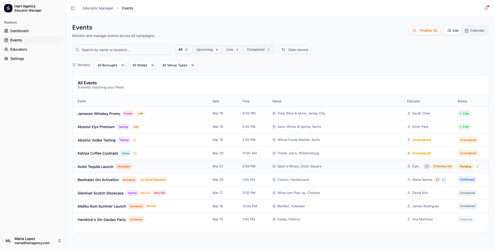

---

### 7. Events Page — Calendar View

**Implemented:** March 26, 2026 · `9f597eb`

Monthly calendar visualization of all events with status-colored dots, providing a visual overview of event distribution across the month.

**Key features:**
- Month navigation with previous/next buttons
- Day cells showing event names with status color indicators
- Green dots for live, amber for pending, red for unassigned
- Today's date highlighted with circle
- Same filter controls as list view
- Toggle between List and Calendar views

**Route:** `/educator/events` (Calendar toggle)

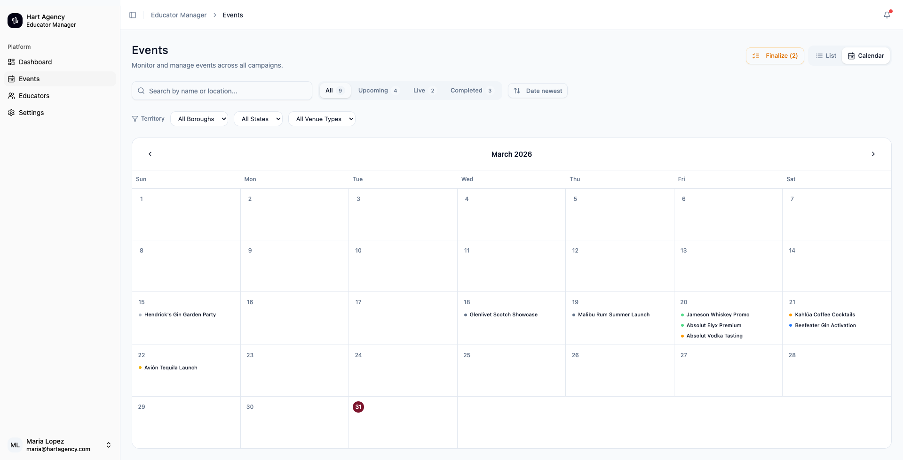

---

### 8. Event Detail — Lifecycle Indicator & Assignment

**Implemented:** March 26, 2026 · `38ea39c` (pre-approval checklist), `4dd8101` (punctuality flags)

Comprehensive event detail page with a visual 6-step lifecycle progress indicator and full event metadata.

**Key features:**
- **Lifecycle progress indicator:** 6-step stepper (Unassigned → Pending → Confirmed → Live → Completed → Finalized)
- Current phase highlighted with filled circle; completed phases show checkmarks
- Status and event type badges in header
- Event metadata grid: Date & Time, Venue (with full address), Assigned Educators, Account type, Products, Brand & Duration
- Compensation details, Kit/Materials pickup location, Store contact info
- Instructions, Goals, and Notes sections
- Cancel Event action button

**Route:** `/educator/events/:eventId`

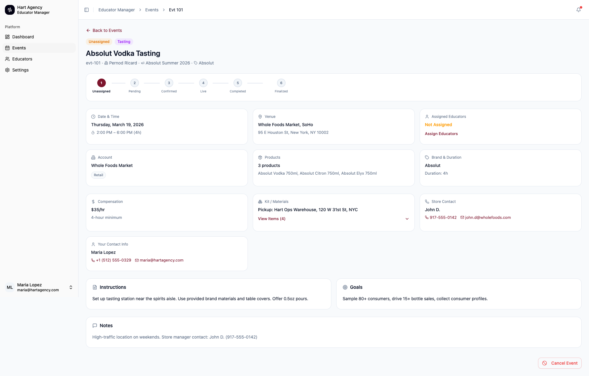

---

### 9. Geography-First Educator Matching

**Implemented:** March 27, 2026 · `4cde1a8`

When assigning educators to events, the system ranks available educators by proximity to the venue using Haversine distance calculation.

**Key features:**
- **Venue context:** Shows event venue name and full address at top of assignment panel
- **Proximity ranking:** Educators sorted by distance to venue
- **Distance tier badges:** Nearby (<10 mi, green), Moderate (10–25 mi, amber), Far (>25 mi, red)
- **Availability indicator:** Available/Unavailable badges per educator
- **Brand certification:** Brand-match badges showing certified brands
- **Quality score:** Score badge with color coding
- **Performance metrics:** Rating, sales/event, on-time percentage
- **Filters:** Sort by Proximity, Sort by Score, Available Only, Brand Certified, < 15 mi radius
- **Brand expertise tags:** Shows which brands each educator has experience with
- Checkbox selection for multi-educator assignment

**Route:** `/educator/events/:eventId` → "Assign Educators" button

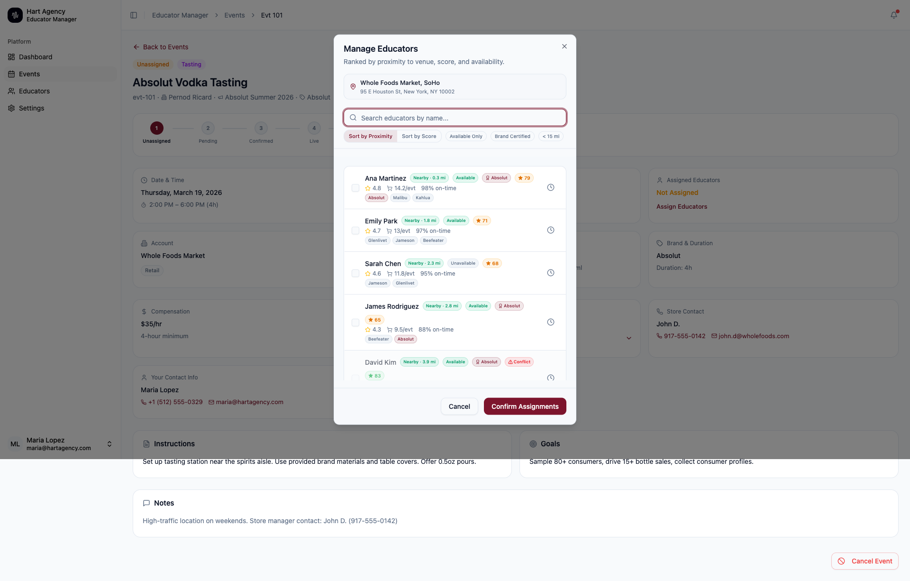

---

### 10. Event Detail — Educator Assignment & Offer Tracking

**Implemented:** March 27, 2026 · `fafd108` (offer tracking), March 31, 2026 · `d5df704` (cancellation requests)

For events in Confirmed/Pending status, the assignment panel shows each assigned educator with their distance, offer status, and response timeline.

**Key features:**
- Assigned educator cards with distance indicator (~28 mi, ~18 mi)
- Offer status badges: Accepted (green), Awaiting Response (yellow)
- Response timestamp ("12d ago", "Sent 12d ago")
- Simulate educator responses with Accept/Reject/Withdraw/Remove buttons
- Manage button to open the full geo-matching assignment panel

**Route:** `/educator/events/evt-105`

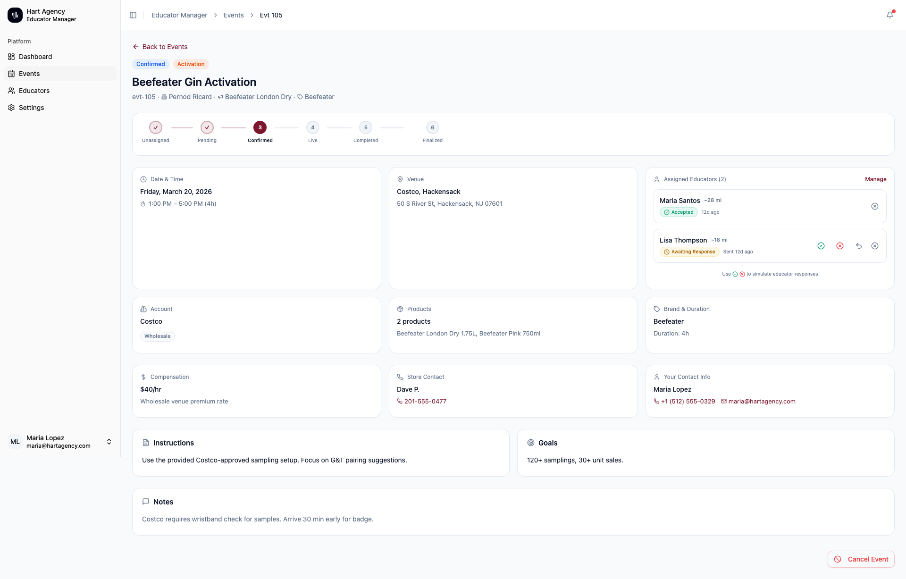

---

### 11. Educator Roster (Manager View)

**Implemented:** March 27, 2026 · `2c3c1b9` (scoring), `890c637` (redesign)

The educator manager's roster view showing all assigned educators with performance metrics, quality scores, and upcoming events.

**Key features:**
- Status filter tabs: All, Active, Inactive
- Search by name, email, or phone
- Sortable columns: Name, Quality, Rating, Sales, On-Time
- Quality score badges with color coding and trend arrows
- Contact quick-actions (email, phone icons)
- Next Event column with date
- Pending Invitation status for new educators
- Events completed count

**Route:** `/educator/educators`

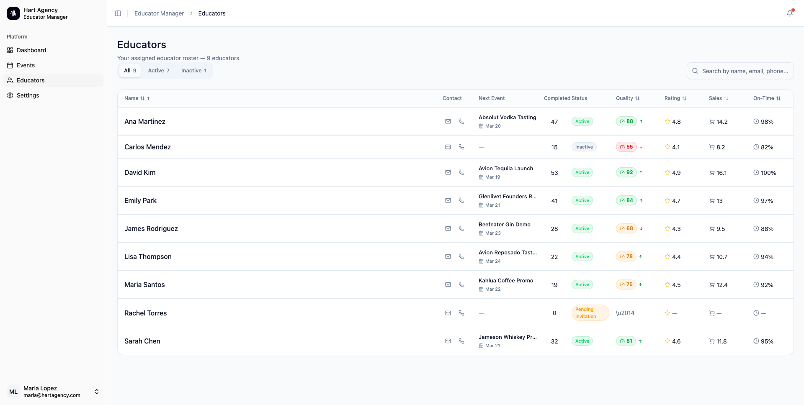

---

### 12. Educator Detail — Profile, Scorecard & Availability

**Implemented:** March 27, 2026 · `2c3c1b9` (scoring), `cfe95e7` (availability calendar), `890c637` (profile redesign)

Detailed educator profile page with comprehensive metrics, performance scorecard, event history, and an integrated availability calendar.

**Key features:**
- **Profile header:** Avatar, name, status, event count, location, distance from manager ("~8 mi from you"), Edit button
- **Contact info grid:** Email, Phone, Home Address
- **Performance metrics:** Avg Rating, Sales/Event, Punctuality, Events This Month, Total Events
- **Brand Certifications:** Tags showing certified brands (Absolut, Malibu, Kahlua)
- **Performance Scorecard:**
  - Circular Quality Score indicator (0–100) with trend delta
  - 5 metric breakdown cards: Retail Sales Avg, Check-in Score, Event Completion Avg, Retailer Survey Score, Cancellation Rating
  - Each metric shows value, trend arrow, and progress bar
  - "Reliable" badge for 100% cancellation rating
- **Upcoming Events:** List with event name, date, time, venue
- **Past Events:** Table with event name, venue, date, rating, sales, on-time percentage
- **Availability Calendar:** Monthly calendar showing available time slots (Morning/Afternoon/Evening) with color coding
- Legend: Fully Available, Partial, Unavailable

**Route:** `/educator/educators/:id`

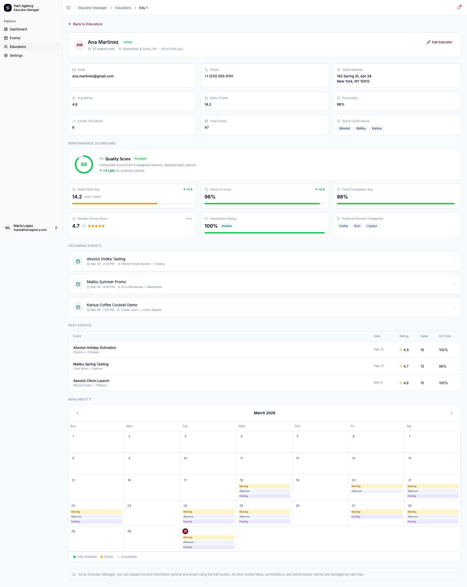

---

### 13. Completed Event — Post-Event Data & Finalization

**Implemented:** March 26, 2026 · `38ea39c` (pre-approval checklist), `4dd8101` (punctuality tracking)

For completed events, the detail page shows comprehensive post-event data including final stats, questionnaire responses, photos, and a finalization workflow.

**Key features:**
- **Punctuality tracking:** "Early Check-out" flag with actual check-in/out times
- **Final Stats grid:** Total Samples, Interactions, Sales, Survey rating, Questionnaires completed, Photos count, Actual Duration
- **Inventory Comparison:** Pre-event vs Post-event counts with sold/used delta
- **Educator Notes:** Free-text post-event observations
- **Questionnaire Responses:** Full survey with question types (rating, yes/no, multiple choice, open text, dropdown)
- **Event Photos:** Gallery with category tabs (All, Receipts, Social Media, Venue) and download option
- **Pre-Approval Checklist:** Required items for finalization (Samples picked up, Evaluations received)
- **Finalization action:** "Approve & Finalize" button to move event to Finalized status

**Route:** `/educator/events/evt-106`

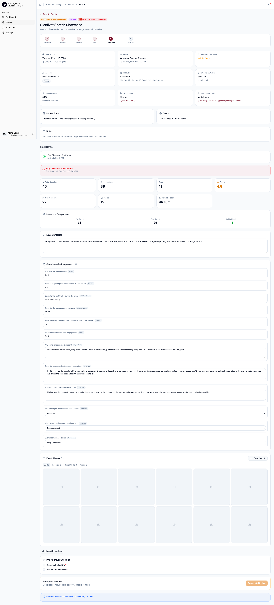

---

## Summary of New Features

| Feature | Platform | Date | Commit(s) |
|---------|----------|------|-----------|
| Educator Availability Calendar | Ops | Mar 27 | `cfe95e7` |
| Educator Performance Scorecards & Quality Scoring | Ops, Educator | Mar 27 | `2c3c1b9`, `7a8df77` |
| Educator Detail Page Redesign | Ops | Mar 27 | `890c637` |
| Educator Dashboard & Offer Status Tracking | Educator Manager | Mar 27 | `fafd108` |
| Geography-First Educator Matching | Educator Manager | Mar 27 | `4cde1a8` |
| Educator Cancellation Request Tracking | Educator Manager | Mar 31 | `d5df704` |
| Punctuality Flags (Late Check-in / Early Checkout) | Educator Manager | Mar 26 | `4dd8101` |
| Pre-Approval Checklist for Event Finalization | Educator Manager | Mar 26 | `38ea39c` |
| 7-State Event Lifecycle (State Machine) | Educator Manager | Mar 26–27 | Multiple |
