# HART Tech Vision — Platform & Architecture Diagrams

> Converted from: `HART - TECH VISION Diagram and Platfrom.vsdx`
> Source: SharePoint / Ambar-Development / 1 Technical Outlines
> Pages: 16

---

## Page 1 — Strategic Vision & Three Pillars

Hart's mission, vision, and three strategic areas of attack.

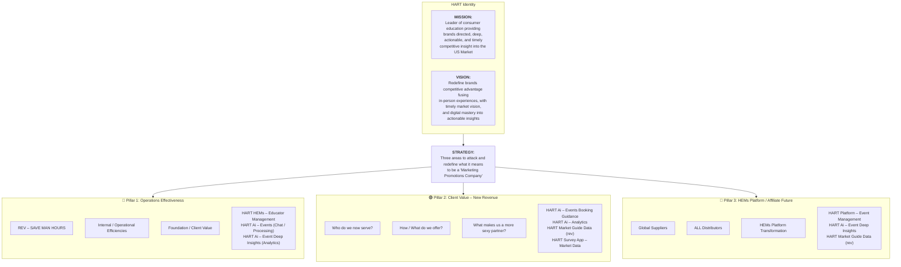

---

## Page 2 — Current HEMs Architecture (As-Is)

The current system showing the HEMs application, data flow, and all actors.

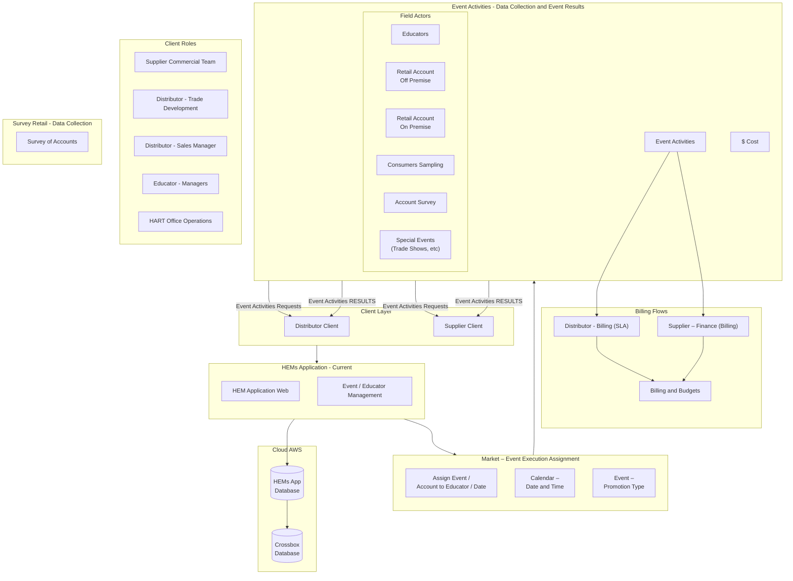

---

## Page 3 — Platform Portal Addition (Phase 1 Enhancement)

Same as Page 2 but adds the **HEMS Platform Portal** and **AI Helpdesk** components.

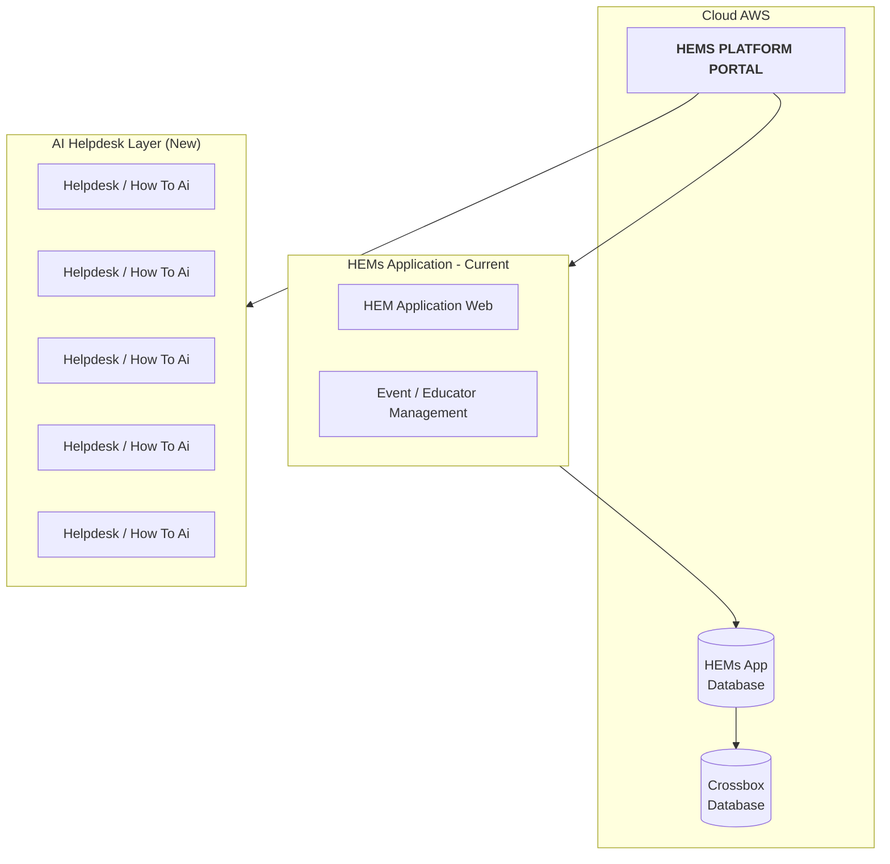

---

## Pages 4-5 — AI Survey App & Image Recognition Pipeline

Pages 4 and 5 add the **HART AI Survey Management** system with image recognition for shelf audits.

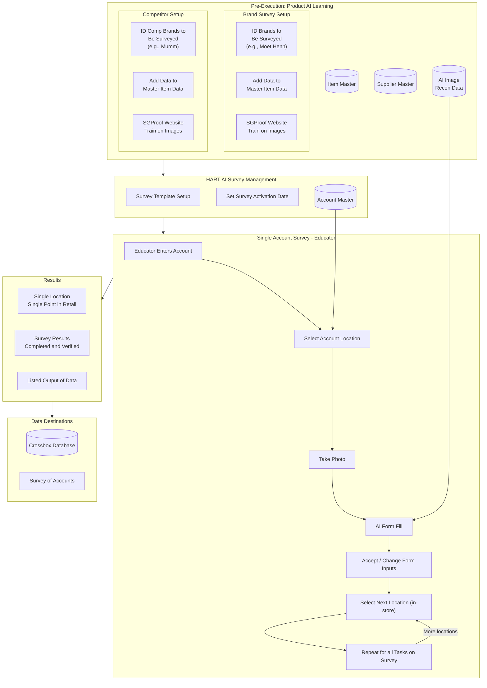

---

## Page 6 — Use Cases & AI Capabilities

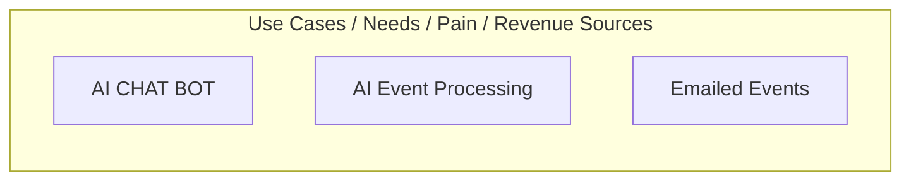

---

## Pages 7-8 — AI Email Event Processing Flow

This is the detailed AI-powered event creation flow from email requests. Page 7 is the simplified version; Page 8 is the full detailed version with all decision branches.

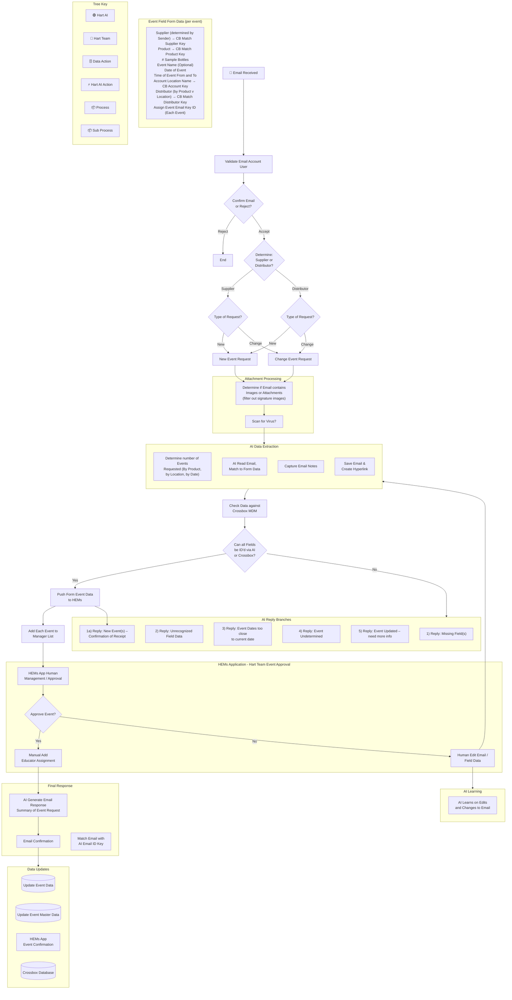

---

## Page 9 — Full Database Schema (Table Definitions)

This page contains the complete database schema with all column definitions. Key tables:

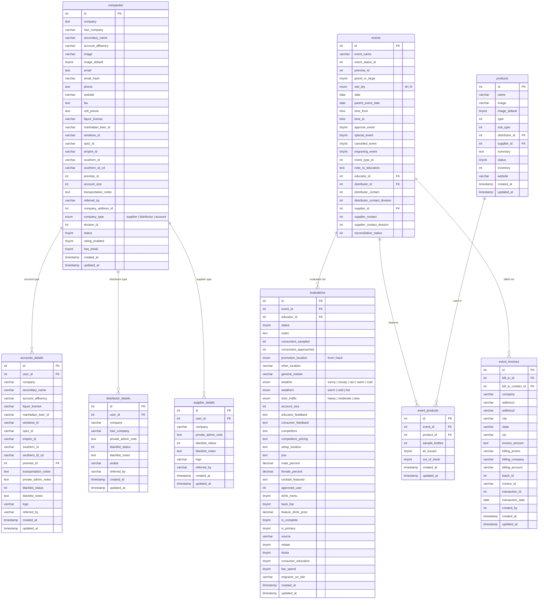

### Additional Tables (from Page 9 & 10)

```mermaid
erDiagram
    job_roles {
        int id PK
        varchar name
        varchar slug
        tinyint is_multiple
    }
    programs {
        int id PK
        varchar name
        tinyint status
    }
    states {
        int id PK
        varchar state_code
        varchar state_name
    }
    promo_codes {
        int id PK
        varchar promo_code
        int user_id FK
    }
    divisions {
        int id PK
        varchar name
        tinyint status
    }
    permissions {
        int id PK
        varchar name
        varchar guard_name
        int reorder
    }
    premises {
        int id PK
        varchar name
        varchar slug
        int display_order
    }
    territories {
        int id PK
        text territory_abbrev
        text territory_name
        int region_id FK
    }
    quickbook_batches {
        int id PK
        varchar batch_name
        varchar type
        tinyint status
        longtext batch_info
        int created_by
        int approved_by
        timestamp approved_at
    }
    quickbook_options {
        int id PK
        text territory_abbrev
        text territory_name
        int region_id
    }
    migrations {
        int id PK
        varchar migration
        int batch
    }
```

---

## Page 10 — Database Domain Organization

Page 10 provides the section headers that organize the schema into logical domains:

1. **HEMs Application - Support Tables** (lookup/reference)
2. **Dimensions** (Suppliers, Distributors, Geography)
3. **Supplier Product - Item**
4. **Event / Promotion / Billing / HART Org – Educators**
5. **Account Evaluation – HEMs Educator Results**
6. **Assets Links – Educators** (Videos, Training, Presentation decks)
7. **HEMs Educator Profile / Employee Profiles**
8. **Accounts (Retailers)** — Assets Links

---

## Page 11 — Strategic Product Mapping

Shows current clients (SGWS, Pernod) mapped to systems (Crossbox, HEMs) with task placeholders for the three pillars.

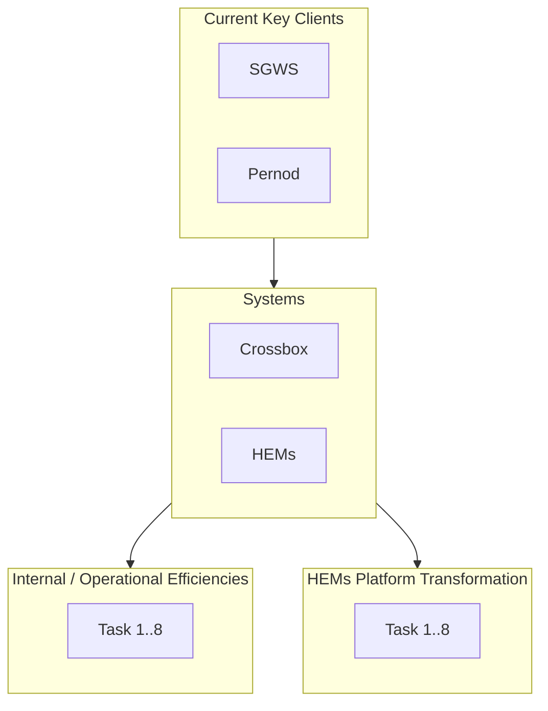

---

## Page 12 — Data Architecture: Crossbox & Integrations

Shows the data flow from HEMs PROD through Crossbox to reporting outputs.

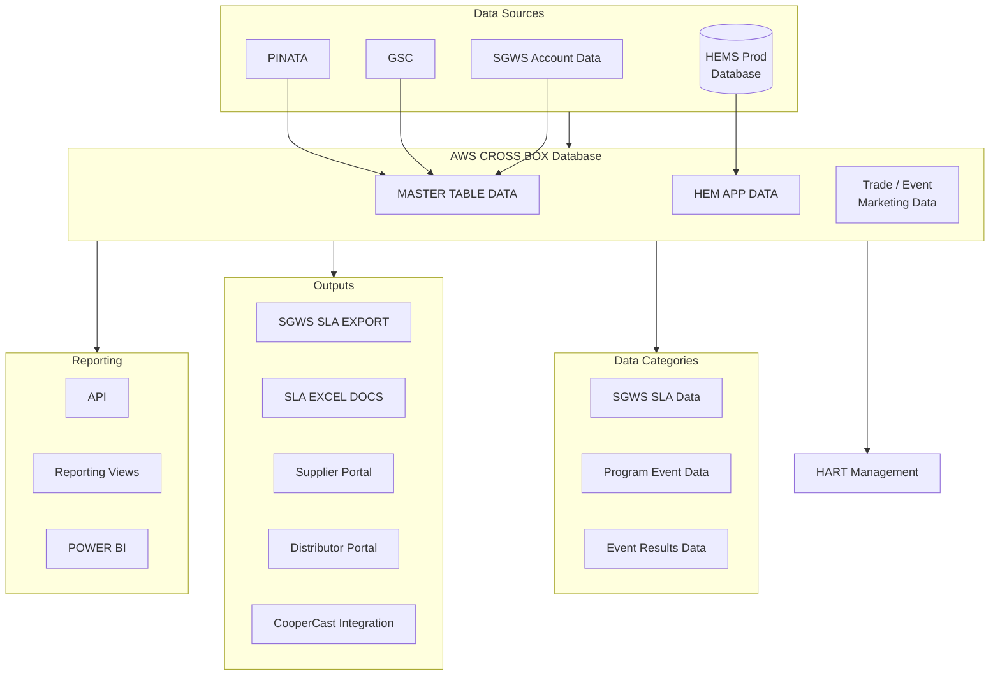

---

## Page 13 — Full Ecosystem: Event Execution + Data Partners + AI

Shows the complete ecosystem including external data partners.

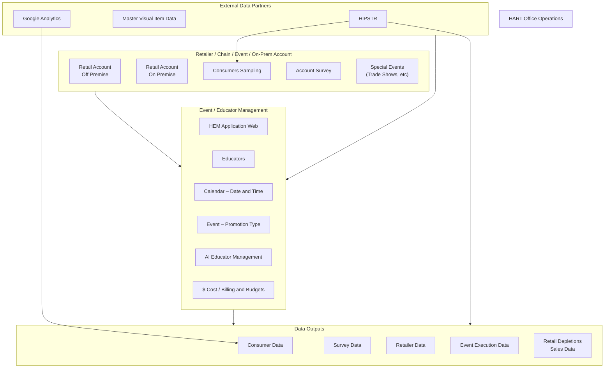

---

## Pages 14-15 — HEMs Application: Back Management + Mobile App

Shows the two-tier architecture: back-office management web app and educator mobile app.

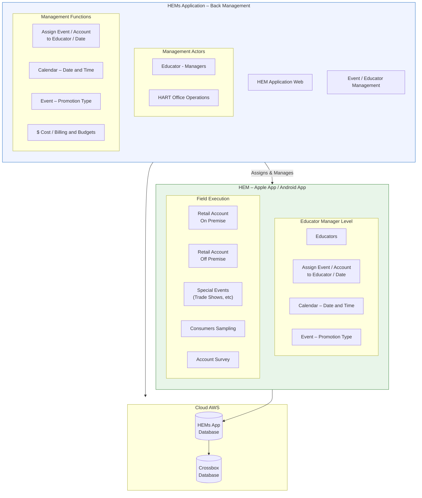

---

## Page 16 — Crossbox Data Warehouse & Master Data Architecture

The most detailed data architecture page showing the full Crossbox schema, master data hierarchy, and multi-tenant organization model.

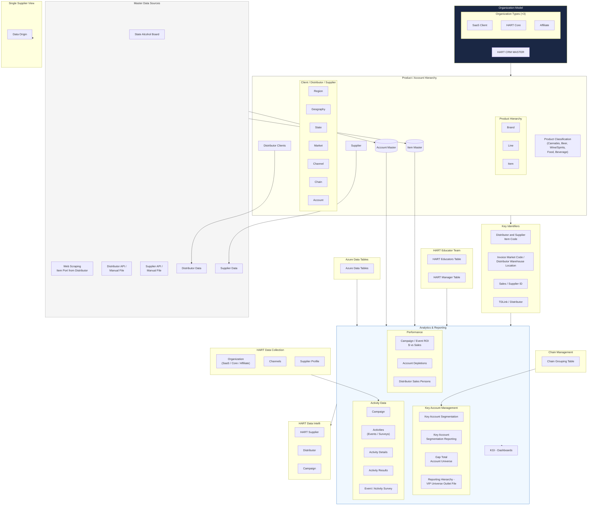

---

## Composite: End-to-End System Flow

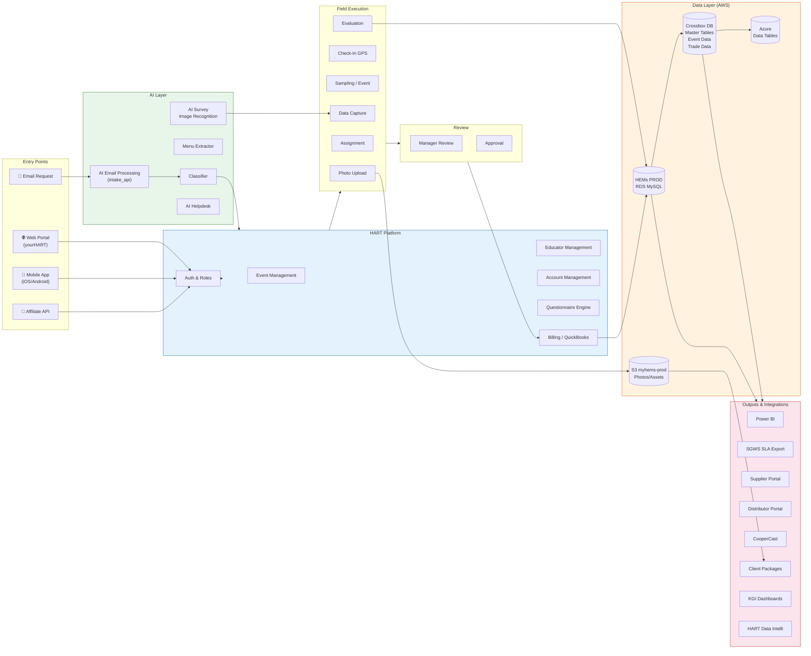

---

## AWS Infrastructure

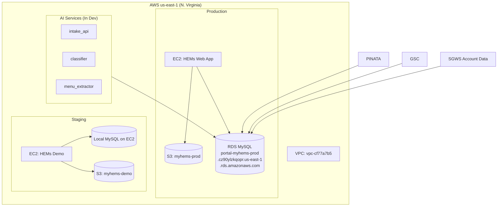
