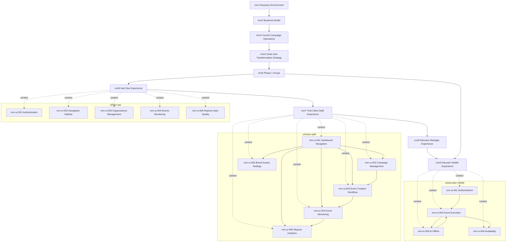

# Models

This directory stores the Hart mental model graph in four groups:

- `business/`: globally unique business-layer models (`mm1` to `mm5`)
- `experience/`: globally unique role/experience models (`mm6` to `mm9`)
- `ui/`: role-scoped UI and feature models
- `templates/`: starter templates for new model authoring

## Structure

```text
models/
├── business/
├── experience/
├── ui/
│   ├── hart-ops/
│   ├── client-staff/
│   └── educator-mobile/
└── templates/
```

## Naming Rules

- Filenames use lowercase kebab-case.
- Business and experience model IDs are globally unique: `mm1`, `mm2`, ..., `mm9`.
- UI model IDs are scoped to their role directory: `ui/client-staff/mm-ui-001-dashboard-navigation.yml`, `ui/hart-ops/mm-ui-001-authentication.yml`, etc.
- `depends_on` means "read before this model".
- `feeds_into` means "read after this model".
- Hart Ops UI models use the standard header:

```yaml
# =============================================================================
# UI & FEATURE MENTAL MODEL — <Title>
# =============================================================================
```

## Dependency Graph

Solid lines below come from explicit `depends_on` or `feeds_into` relationships in the files. Dotted lines indicate the parent experience model that gives a UI stream its context. Some Hart Ops and client-staff UI dependencies are still marked `TBD` in the source files and are therefore not shown as solid edges.



## Authoring Notes

- Put new business-layer models in `business/`.
- Put new role/experience models in `experience/`.
- Put new UI models under the correct role directory in `ui/`.
- Start from the matching file in `templates/`.
- When a UI model references another UI model, keep the reference within the same role stream unless the file explicitly needs a cross-role link.
